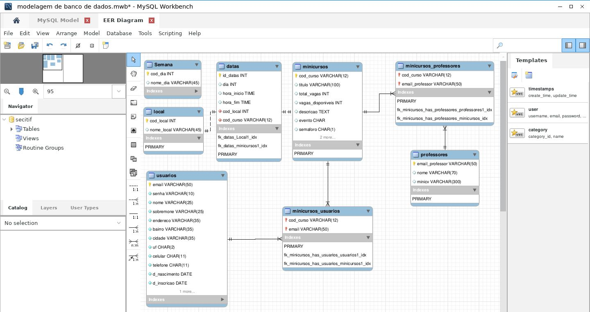

# SECITIF

Source code of Weeks of Science and Technology of IFCE campus Cedro.

## How to run

You need install docker and docker-compose. Then run this command:

```bash
sudo docker-compose up -d
```

## Screenshorts


